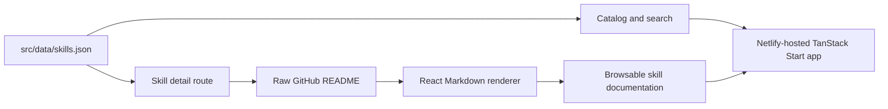

# Skillfolio

> A searchable portfolio for discovering, evaluating, and installing reusable skills for AI coding agents.

[](https://skillfoliox.netlify.app)
[](https://github.com/montasim/Skillfoliox/commits/main)
[](https://www.supportkori.com/montasim)

Skillfolio gives developers one place to browse Montasim's reusable agent skills, understand what each skill does, inspect its source documentation, and copy its verified install command. The catalog is intentionally file-backed: skill metadata lives in local JSON, while each detail page fetches and renders the skill repository's current `README.md` directly from GitHub.

**[Open Skillfolio](https://skillfoliox.netlify.app) · [Explore Write Project README](https://skillfoliox.netlify.app/skills/write-project-readme) · [Report an issue](https://github.com/montasim/Skillfoliox/issues)**

[](https://skillfoliox.netlify.app)

## Why Skillfolio?

Agent skills are small instruction packages, but evaluating them often requires moving between repositories, release notes, README files, and install instructions. Skillfolio turns that scattered information into a consistent catalog experience:

- Search and filter skills from a single responsive library.
- Compare purpose, category, status, version, compatibility, and common uses.
- Read the source repository's latest README without leaving the detail page.
- Copy the pinned GitHub installation command.
- Open the original repository whenever source-level verification is needed.

The project is designed for a personally maintained collection rather than an automatically indexed marketplace. Every listed skill is added deliberately through a reviewed local JSON record.

## Current capabilities

- Searchable and category-filtered skill catalog
- Featured-skill and library-status summaries
- Dedicated, shareable route for every skill
- GitHub-flavored Markdown rendering with tables, code blocks, lists, links, and images
- Relative README links and images resolved against the source repository
- Loading skeletons that match the final catalog and documentation layouts
- Retry and source-link fallbacks when GitHub README loading fails
- Copy-to-clipboard install commands
- Responsive navigation and reduced-motion-aware animation
- Canonical metadata, Open Graph and Twitter cards, JSON-LD, sitemap, robots file, favicon, web app manifest, and install icons
- Netlify-compatible TanStack Start SSR deployment

### Current library

| Skill | Status | Compatibility | Purpose |
| --- | --- | --- | --- |
| [Write Project README](https://skillfoliox.netlify.app/skills/write-project-readme) | Stable · v0.3.0 | OpenAI Codex, Claude Code | Build a complete project README from verified repository evidence. |
| [Ensure Social Preview](https://skillfoliox.netlify.app/skills/ensure-social-preview) | Stable · v0.1.0 | OpenAI Codex, Claude Code | Audit, create, repair, and verify large-image social previews. |

Catalog values come from [`src/data/skills.json`](src/data/skills.json); they are not synchronized automatically with GitHub releases.

## Using the live application

1. Open the [Skillfolio library](https://skillfoliox.netlify.app).
2. Search by skill name, summary, category, or description, or select a category filter.
3. Open a skill card to review its status, version, compatibility, repository, and rendered documentation.
4. Copy the pinned install command from the installation panel.
5. Use **View on GitHub** or **View source** when you need to inspect the original repository.

The README panel loads from `raw.githubusercontent.com` in the browser. If GitHub is unavailable, blocked, or rate-limited, use the retry control or open the source repository directly.

## How it works



- TanStack Router creates the catalog route and the `/skills/$slug` detail route.
- Local JSON supplies stable catalog metadata, installation commands, source URLs, and compatibility labels.
- The browser fetches the configured raw README URL and renders it with `react-markdown` and `remark-gfm`.
- Raw HTML inside fetched Markdown is skipped. Relative links and images are rewritten to the configured repository and branch.
- The application has no database, authentication system, application API, or content-management backend.
- Netlify's TanStack Start adapter packages the SSR entry point as a Netlify function during production builds.

## Technology

| Area | Technology |
| --- | --- |
| Application | TanStack Start, TanStack Router, React 19, TypeScript |
| Build | Vite 8, pnpm |
| Interface | Tailwind CSS 4, shadcn/ui, Radix UI, Lucide icons |
| Documentation rendering | react-markdown, remark-gfm |
| Typography | Geist Variable |
| Deployment | Netlify with `@netlify/vite-plugin-tanstack-start` |
| Data source | Local JSON metadata and public GitHub README files |

## Local development

### Prerequisites

- Node.js 24
- pnpm 10.30.3 or a compatible newer release
- Git

No database, API key, or external service account is required for local development. Internet access is needed when viewing README content fetched from GitHub.

### 1. Clone and install

```bash
git clone https://github.com/montasim/Skillfoliox.git
cd Skillfoliox
pnpm install
```

### 2. Configure the canonical URL

Copy the safe environment template:

```bash
cp .env.example .env.local
```

`VITE_SITE_URL` controls canonical links, social metadata, `robots.txt`, and `sitemap.xml`. The committed default is the production deployment:

```dotenv
VITE_SITE_URL=https://skillfoliox.netlify.app
```

Use your own absolute origin when deploying a fork or custom domain. This variable is public build configuration, not a secret.

### 3. Start the development server

```bash
pnpm dev
```

Open [http://localhost:3000](http://localhost:3000). The document metadata continues to use `VITE_SITE_URL`, so change the local environment value if you specifically need localhost canonical URLs.

## Adding a skill

Add one object to [`src/data/skills.json`](src/data/skills.json). The TypeScript shape is defined in [`src/lib/skills.ts`](src/lib/skills.ts).

```json
{
  "slug": "example-skill",
  "name": "Example Skill",
  "mark": "ES",
  "category": "Automation",
  "status": "Stable",
  "version": "1.0.0",
  "featured": false,
  "summary": "A concise result-oriented summary.",
  "description": "A longer description used by search and page metadata.",
  "repository": "https://github.com/owner/example-skill",
  "branch": "main",
  "installCommand": "npx --yes --package=github:owner/example-skill#v1.0.0 example-skill",
  "compatibility": ["OpenAI Codex"],
  "uses": ["Example workflow"]
}
```

When adding or updating an entry:

1. Use a unique URL-safe `slug`; it becomes `/skills/<slug>`.
2. Confirm the repository, branch, version, and install command resolve successfully. README and source URLs are derived from the repository facts.
3. Keep `summary` short enough for a catalog card and use `description` for search and SEO context.
4. Set exactly one catalog entry as `featured`; it is used by the homepage callout.
5. Run `pnpm build` to regenerate `public/sitemap.xml` and `public/robots.txt` with every skill route.
6. Open the detail page and check README links, images, tables, and code blocks.

## Development commands

| Command | Purpose |
| --- | --- |
| `pnpm dev` | Start the Vite development server on port 3000. |
| `pnpm generate:seo` | Regenerate `public/sitemap.xml` and `public/robots.txt`. |
| `pnpm build` | Generate SEO files and build the client, SSR bundle, and Netlify function entry. |
| `pnpm lint` | Run ESLint. |
| `pnpm typecheck` | Check TypeScript without emitting files. |
| `pnpm check` | Check JavaScript and TypeScript formatting with Prettier. |
| `pnpm format` | Rewrite JavaScript and TypeScript files with Prettier. |
| `pnpm test` | Run the catalog, publishing, Repository README, and Skill-detail frame tests. |

The verified passing checks for the current repository are:

```bash
pnpm lint
pnpm typecheck
pnpm build
```

## Deployment

Skillfolio is deployed at [skillfoliox.netlify.app](https://skillfoliox.netlify.app) from the `main` branch.

[`netlify.toml`](netlify.toml) pins the deployment settings:

- Build command: `pnpm run build`
- Publish directory: `dist/client`
- Node.js: 24
- pnpm: 10.30.3
- Canonical site URL: `https://skillfoliox.netlify.app`

The Netlify Vite adapter writes the SSR handler to `.netlify/v1/functions/server.mjs` during the build. `.netlify`, `dist`, and dependencies are generated artifacts and are not committed.

For another Netlify project or a custom domain, update `VITE_SITE_URL` in the deployment environment and regenerate the SEO files. Confirm the deployed homepage, each skill route, `/robots.txt`, `/sitemap.xml`, and social preview URLs after deployment.

## Project structure

```text
src/
├── components/          Skill-detail frame, README module, shared layout, and shadcn UI
├── data/skills.json     File-backed skill catalog
├── lib/                 Deep catalog and Publishing metadata modules
└── routes/              Catalog and skill detail routes
public/                  Icons, manifest, social preview, robots, and sitemap
scripts/generate-seo.mjs Sitemap and robots generator
prototypes/v1/           Preserved static HTML/Tailwind CDN prototype
netlify.toml             Netlify build and production URL configuration
```

## Status and limitations

Skillfolio is a small, actively evolving personal portfolio. Current constraints are:

- The catalog is manually maintained and validated during development and builds.
- Skill metadata and pinned versions do not update automatically from GitHub.
- README rendering depends on public GitHub and `raw.githubusercontent.com` availability.
- Only public README URLs are supported; there is no authentication flow for private repositories.
- Search and category filtering run in the browser against the bundled JSON catalog.
- Automated tests cover catalog invariants, Publishing metadata, Repository README behavior, and Skill-detail states.
- The current Prettier check is not yet clean; lint, type-checking, tests, and production builds pass.
- The application itself does not store user accounts, form submissions, or catalog data in a database. Hosting and GitHub requests remain subject to those providers' policies and logs.

## Support and security

Use [GitHub Issues](https://github.com/montasim/Skillfoliox/issues) for reproducible bugs and feature requests. Include the affected URL, browser, expected behavior, and actual behavior when possible.

The repository does not currently include a dedicated security policy or private vulnerability-reporting channel. Do not post credentials, private repository URLs, tokens, or other sensitive details in a public issue.

## Contributing

Issues and pull requests are welcome. For a code contribution:

1. Fork the repository and create a focused branch.
2. Keep skill records evidence-based and verify every external URL.
3. Run `pnpm lint`, `pnpm typecheck`, and `pnpm build`.
4. Describe the user-visible change and any remaining limitations in the pull request.

The project does not yet include dedicated `CONTRIBUTING.md` or `CODE_OF_CONDUCT.md` files.

## Funding

If Skillfolio is useful to you, optional support through [SupportKori](https://www.supportkori.com/montasim) helps maintain the catalog, hosting, and continued development. Bug reports, documentation improvements, code contributions, and sharing the project are equally valuable ways to help.

## Author

Built and maintained by [Montasim](https://github.com/montasim).

## License

This repository does not currently include a `LICENSE` file. Do not assume that an open-source license has been granted.
